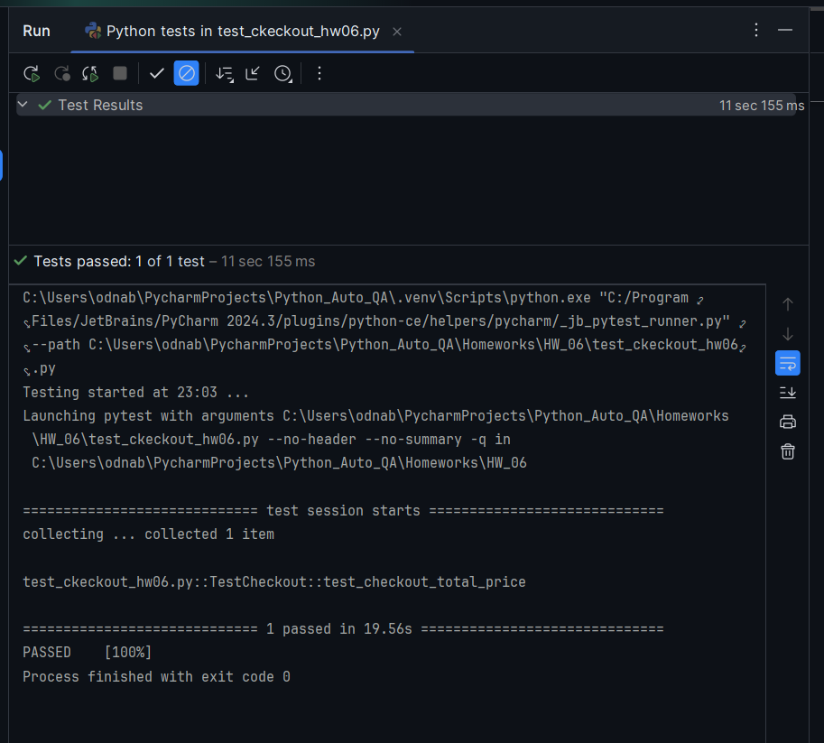
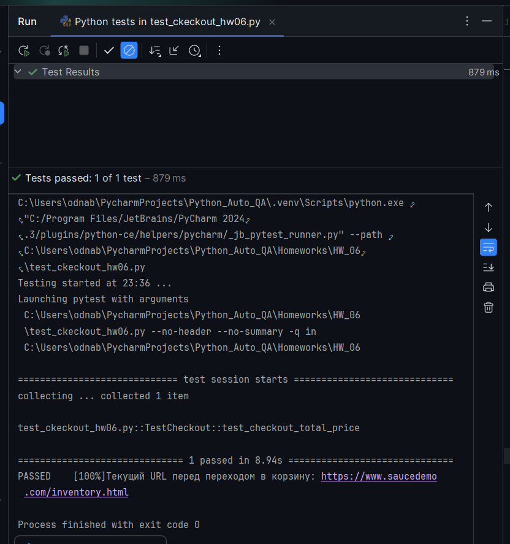
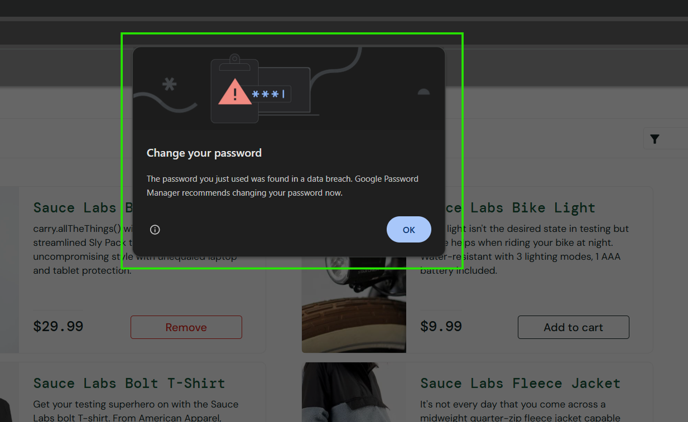
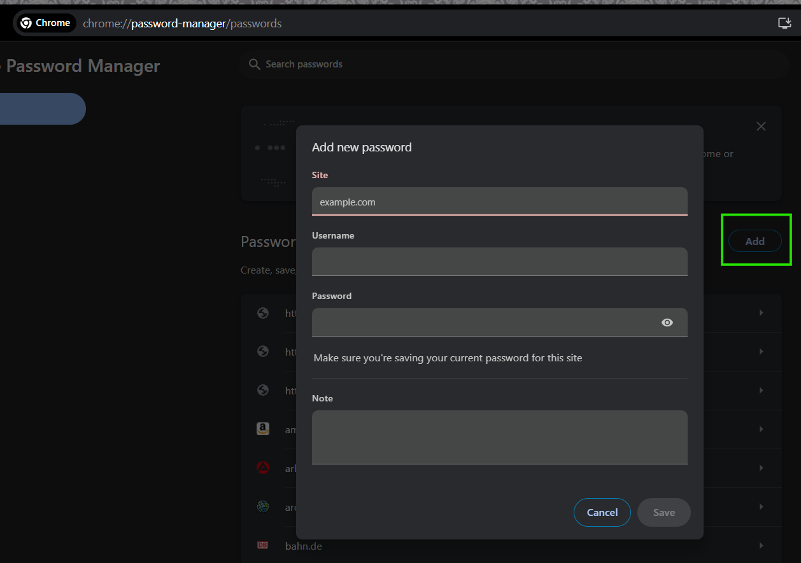
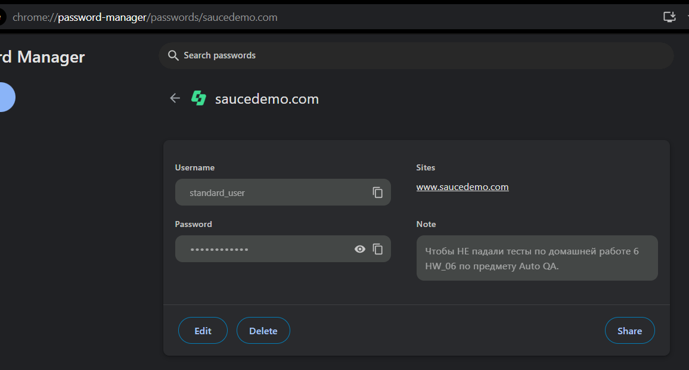
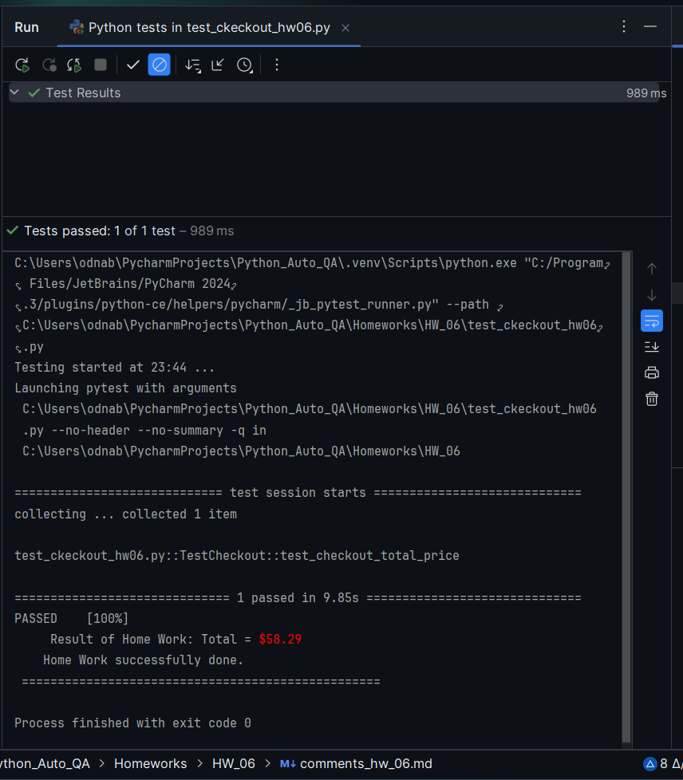

Auto QA  
1.07.2025

### <div style="color: #008000">Домашнее задание 6: Page Object Model (POM)</div>    
Напишите автоматизированный тест с использованием Page Object Model (POM), 
который выполняет следующие шаги:  
1. Откройте сайт магазина: https://www.saucedemo.com/.
2. Авторизуйтесь как пользователь standard_user.
3. Добавьте в корзину товары:
   - Sauce Labs Backpack
   - Sauce Labs Bolt T-Shirt
   - Sauce Labs Onesie
4. Перейдите в корзину.
5. Нажмите Checkout.
6. Заполните форму своими данными:
   - Имя
   - Фамилия
   - Почтовый индекс
7. Прочтите со страницы итоговую стоимость (Total).
8. Закройте браузер.
9. Проверьте, что итоговая сумма равна $58.29.  

Требования:  
- Использовать Page Object Model для организации кода.  
- Вынести все локаторы и методы работы со страницами в отдельные классы (Page Object).  
- Тест должен быть независимым и запускаться без предварительной подготовки данных.  


<div style="font: bold normal 110% sans-serif; color: #8A2BE2; white-space: pre; border-top: 2px dotted #008000; padding: 5px;"></div>  

### <span style="color: #008000">Источники</span>  
<span style="color: #606060">Видео - урок от 18.06.2025</span> [<fodont color="#696969">[1 - ▶  Video 11]</font>](#v1).  
1. ▶ Video 11 "Page Object Model" (18.06.2025): <a id="v1">https://player.vimeo.com/video/1094342662?h=f20d6c2fc7.</a>    
2. Presentation  <a id="p1">Les11-Auto QA_6-Page Object Model - 18_06.pdf.pdf</a>  
3. Conspectus <a id="c1">Les11-Auto QA_LfS6 (1)-Page Object Model - 18_06.pdf.pdf</a>  
4. Примеры в <a id="ex1">Les_11</a>.
5. Summary 6 <a id="s1">Les12-Auto QA_SUM6-POM</a>.
6. Руководство по оформлению Markdown файлов: https://gist.github.com/Jekins/2bf2d0638163f1294637.


<div style="font: bold normal 110% sans-serif; color: #8A2BE2; white-space: pre; border: 2px outset #8A2BE2; margin: 60px 0 40px 0; padding: 5px 0 5px 25px;">ДЕЙСТВИЯ</div>


## <a id="s1" style="color: #008000">1. Реализация кода для тестирования в рамках POM-подхода</a>

Смотри пример с кодом в папке <a>Lessons/Les_11/POM/example_3</a>.


Login: standard_user  
Password: secret_sauce  

<div style="font: small-caps 120% sans-serif; color: #8A2BE2; padding: 0 15px 0 0;">▣ &nbsp;&nbsp; Тест то проходит:</div><p>  

<br>  

  

<a id="img1" style="margin: 0 0 0 40px; color:#606060;">Fig. 1 ____.</a>


<div style="font: small-caps 120% sans-serif; color: #8A2BE2; padding: 0 15px 0 0;">▣ &nbsp;&nbsp; То падает из-за системного всплывающего окна Google Chrome:</div><p>

  

<a id="img2" style="margin: 0 0 0 40px; color:#606060;">Fig. 2. ____.</a>


<div style="font: small-caps 120% sans-serif; color: #8A2BE2; padding: 0 15px 0 0;">▣ &nbsp;&nbsp; Проблема решена:</div><p>  

Как в Хром отключить системное всплывающее окно о подтверждении смены пароля:  
1. https://support.google.com/chrome/thread/260568823/%D0%92%D1%81%D0%BF%D0%BB%D1%8B%D0%B2%D0%B0%D1%8E%D1%89%D0%B5%D0%B5-%D0%BE%D0%BA%D0%BD%D0%BE-%D1%81%D0%BC%D0%B5%D0%BD%D0%B8%D1%82%D0%B5-%D0%BF%D0%B0%D1%80%D0%BE%D0%BB%D1%8C-%D0%B2-%D1%80%D0%B5%D0%B6%D0%B8%D0%BC%D0%B5-%D1%83%D0%BF%D1%80%D0%B0%D0%B2%D0%BB%D0%B5%D0%BD%D0%B8%D1%8F-%D1%85%D1%80%D0%BE%D0%BC%D0%B4%D1%80%D0%B0%D0%B9%D0%B2%D0%B5%D1%80%D0%BE%D0%BC?hl=ru.  
<span style="color: red">НО, это НЕ вариант!</span>  
2. Сделать, как посоветовали здесь: https://www.reddit.com/r/chrome/comments/1avxxzh/how_can_i_get_rid_of_this_change_password_warning/?tl=ru.  

Так есть ли способ отключить это всплывающее окно на localhost:{номер порта}?  
https://www.reddit.com/r/chrome/comments/1avxxzh/comment/krelyzs/?tl=ru&utm_source=share&utm_medium=web3x&utm_name=web3xcss&utm_term=1&utm_content=share_button.  
ЕСТЬ! Проделать такие действия в самом Хроме:
> Там не было записи для моего сайта (localhost:порт), но твой совет сработал после того, как 
> я добавил его вручную:  
> 1. Добавил сайт вручную в chrome://password-manager/passwords  
> 2. Просканировал в chrome://password-manager/checkup  
> 3. Кликнул на предупреждение и выбрал опцию игнорировать  


  



<a id="img3" style="margin: 0 0 0 40px; color:#606060;">Fig. 3. ____.</a>


РЕЗУЛЬТАТ:

  

<a id="img4" style="margin: 0 0 0 40px; color:#606060;">Fig. 4. ____.</a>


<div style="font: small-caps 120% sans-serif; color: #8A2BE2; padding: 0 15px 0 0;">▣ &nbsp;&nbsp; Рекомендации Чат по отключению настроек:</div><p>  

<div style="margin: 20px 20px 20px 0;">
<b style="color: #F00000; border: 2px solid #6B0000; padding: 10px; margin: 10px 10px 10px 0;"> NB ! </b> К сожалению, отключением системного всплывающего окна Хром по 
рекомендациям Чата и предложенной им пошаговой инструкции (см. ниже) по отключению этого окна, 
обойти проблему всплывающего системного окна с информацией о небезопасном пароле НЕ удалось.
</div>
<p>  

### **Системное всплывающее окно Google Chrome** — не часть DOM, и с ним есть один важный нюанс.

<div style="margin: 20px 20px 20px 0;">
<b style="color: #F00000; border: 2px solid #6B0000; padding: 10px; margin: 10px 10px 10px 0;"> NB ! </b> Важно: <span style="color: royalblue">Chrome password prompt</span>
<span style="color: red">НЕ</span> является частью HTML-DOM.
</div>

Значит: Selenium <span style="color: red">НЕ</span> может взаимодействовать с этой панелью 
напрямую — ни по `By.XPATH`, ни по `By.ID`, потому что это **встроенное браузерное (native) окно**, а не часть страницы.

### <a style="color: #008000">Решение</a>

**Отключить Chrome Password Manager** (самое простое и стабильное решение)  
Изменить запуск браузера — **добавить опции** в `base_test.py`, чтобы отключить это 
поведение в `BaseTest` в методе `setup`:
```python
from selenium.webdriver.chrome.options import Options

class BaseTest:
    @pytest.fixture(autouse=True)
    def setup(self):
        chrome_options = Options()

        # Отключение предложение сохранить пароль и предупреждение о взломе:
        prefs = {
            "credentials_enable_service": False,
            "profile.password_manager_enabled": False
        }
        chrome_options.add_experimental_option("prefs", prefs)

        self.driver = webdriver.Chrome(
            service=ChromeService(ChromeDriverManager().install()),
            options=chrome_options
        )
        self.driver.maximize_window()
        self.driver.get("https://www.saucedemo.com/")

        self.login_page = LoginPage(self.driver)
        self.inventory_page = InventoryPage(self.driver)
        self.cart_page = CartPage(self.driver)
        self.checkout_page = CheckoutPage(self.driver)

        yield
        # Закрытие браузера:
        self.driver.quit()
```
Эти настройки отключают:
* сохранение пароля
* автоматические всплывающие панели Google Password Manager
После этого тест больше не будет падать из-за панели.

Почему не стоит пытаться "нажать OK"
* Эта панель не в DOM → `find_element(...)` не сработает
* Даже `Alert` из Selenium не поймает это окно
* Попытки нажимать клавиши через JavaScript — ненадёжны


<div style="font: bold normal 110% sans-serif; color: #8A2BE2; white-space: pre; border-top: 2px dotted #008000; padding: 5px;"></div>  

## <a id="s4" style="color: #008000">2. GitHub</a>
Ссылка на комментарии по ДЗ <a>comments_hw_06.md</a> со скриншотами: ____.  

Ссылка на папку с ДЗ <a>HW_06</a>: ____.  

---
<div style="font: bold normal 110% sans-serif; color: #8A2BE2; white-space: pre; border-top: 2px dotted #8A2BE2; padding: 5px; margin: 40px 0 40px 0"></div>

[//]: # (Строка с отступами сверху и снизу --- <div style="margin: 40px 0 40px 0">Текст</div>)

[//]: # (Подзаголовок Фиол--- <div style="font: small-caps 120% sans-serif; color: #8A2BE2; padding: 0 15px 0 0;">▣ &nbsp;&nbsp; Выполните запросы:</div>  )

[//]: # (ссылка на источник --- [<font color="#696969">[1 ▶ V-13, \__:__]</font>]\(#__\).  )

[//]: # (<span style="color: #8A2BE2; margin: 20px 40px; padding: 5px; background: #000000;">▣ ⚜️ ☑️ ✔️ 🟪 ■ ※ ⁂ ⁙ ⁘ ⨠  ■ ◲◳ ◆ ◇ ◈ ◀ ▶ ◁ ▷ ▹ ▼ ▲ ▽ △ ▢ ₪₪₪</span>  ) 

[//]: # (🔷🔹 🟩 ❇️♾️⚜️✳️❎✅☑️✔️🟪🔳🔲  )
[//]: # (■ ⁜ ※ ⁂ ⁙ ⁘ ⫷ ⫸ ⩕ ⨠ ⨝ ⋘ ⋙ ∵ ∴ ∶ ∷ ■ ◪ ◩ ◲ ◳ ◆ ◇ ◈ ▼ ▽ ◀ ▶ ◁ ▷ ▹ ▲ △ ▢ ₪₪₪  )


[//]: # (NB! --- <div style="color: #F00000; margin: 40px 20px 20px 0;">)

[//]: # (<span style="border: 2px solid #6B0000; padding: 10px;"> NB ! </span>)

[//]: # (</div>)


[//]: # (Пробел  ---  &nbsp;&nbsp; spaces)

[//]: # (Линия-разделитель с отступами --- <div style="font: bold normal 110% sans-serif; color: #8A2BE2; white-space: pre; border-top: 2px dotted #008000; padding: 5px;"></div>)
