Auto QA  
25.06.2025

### <div style="color: #008000">Домашнее задание 7: Введение в Requests</div>    

- Разработать автоматические тесты, которые проверяют корректность работы API 
для управления сотрудниками.
- Создайте класс EmployeeApi для создания вспомогательных методов.

API Методы:

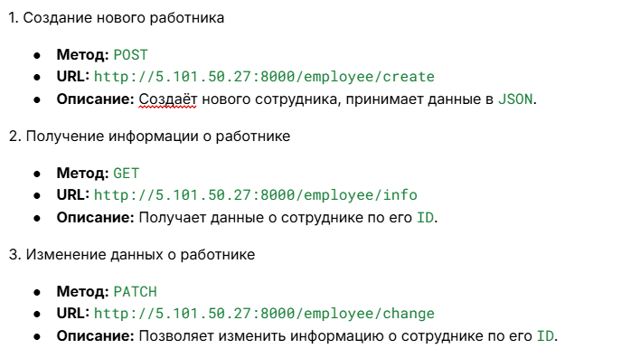  
<p>


<div style="font: bold normal 110% sans-serif; color: #8A2BE2; white-space: pre; border-top: 2px dotted #008000; padding: 5px;"></div>  

### <span style="color: #008000">Источники</span>  
<span style="color: #606060">Видео - урок от 24.06.2025</span> [<fodont color="#696969">[1 - ▶  Video 13]</font>](#v1).  
1. ▶ Video 13 "Введение в Requests" (24.06.2025): <a id="v1">https://player.vimeo.com/video/1095888997?h=11b8f2174a.</a>    
2. Presentation <a id="p1">Les13-Auto QA_7-NEW-Requests-24_06.pdf</a>  
3. Conspectus <a id="c1">Les13-Auto QA_LfS7-NEW-Requests-24_06.pdf</a>  
4. Примеры в <a id="c1">Les_13</a>.
5. Документация приложения <a id="doc1">http://5.101.50.27:8000/docs#</a>.
6. Руководство по оформлению Markdown файлов: https://gist.github.com/Jekins/2bf2d0638163f1294637.


<div style="font: bold normal 110% sans-serif; color: #8A2BE2; white-space: pre; border: 2px outset #8A2BE2; margin: 60px 0 40px 0; padding: 5px 0 5px 25px;">ДЕЙСТВИЯ</div>


<div style="margin: 20px 20px 20px 0;">
<b style="color: #F00000; border: 2px solid #6B0000; padding: 10px; margin: 10px 10px 10px 0;"> NB ! </b>
Сначала перейти на страницу <a>http://5.101.50.27:8000/docs#/employee/get_list_employee_employee_list__company_id__get</a> 
<p>и ознакомиться с документацией приложения, где представлены все эндпоинты. <br>
Там видно, что знак НЕ нужен _?_ <br>
<span style="color: dimgrey">Максим, а как ты нашел эту страницу c docs?</span><br>  
Добавляешь эндпоинт к адресу <a>http://5.101.50.27:8000</a>: <br>
- <a>/doc#</a> - для openApi <br>
- <a>/swager</a> - для swager <br>
<span style="color: red">и смотришь есть ли документация.</span>
</div>

  

<a id="img1" style="margin: 0 0 0 40px; color:#606060;">Fig. 1. Вид страницы http://5.101.50.27:8000/docs#/superuser.</a>


<div style="font: small-caps 120% sans-serif; color: #8A2BE2; padding: 0 15px 0 0;">▣ &nbsp;&nbsp; Логин–пароль в виде пар</div>
Как хранить логин–пароль в виде ПАР.  
В <a>.env</a>:

```python
# ____ EXAMPLES ____
CREDENTIALS=admin1:pass123,admin2:pass456,test_user:testpass
```
В файле с кодом:

```python
creds_str = os.getenv("CREDENTIALS")
pairs = [item.split(":") for item in creds_str.split(",")]
credentials = {login: pwd for login, pwd in pairs}

# Для использования вызвать:
print(credentials["admin2"])  # → pass456

```
Смотри пример с кодом в файле [Python_Auto_QA\Lessons\Les_13\try_env.py](Lessons/Les_13/try_env.py).


<div style="font: bold normal 110% sans-serif; color: #8A2BE2; white-space: pre; border-top: 2px dotted #008000; padding: 5px; margin: 40px 0 40px 0"></div>

## <a id="s1" style="color: #008000">1. Создание нового работника</a>  

Смотри источники:  
- _простые_ примеры в <a>test_request_4.py, test_request_5.py</a>, 
- **полные** примеры в папках <a>test_request_7, test_request_8py</a>,
- test_request_4.py --> [<font style="color: #606060;">[2, слайд 73, 78, 136]</font>](#p1) и далее,
- test_request_4.py --> [<font color="#696969">[1 ▶ V-13, 1:08:50]</font>](#v1) и далее.  

<div style="margin: 20px 20px 20px 0;">
<b style="color: #F00000; border: 2px solid #6B0000; padding: 10px; margin: 0 10px 0 0;"> NB ! </b>
Токен <b style="color: red">user_token</b> нужно передавать в <b style="color: red">каждом запросе</b>, требующем авторизации.
</div>

### <a id="s1.1" style="color: #008000">1.1. Создание класса EmployeeApi</a>
Для создания вспомогательных методов: .
См. пример [<font color="#696969">[1 ▶ V-13, \_:__:__]</font>](#v1), 
[<font style="color: #606060;">[2, слайд \__]</font>](#p1).


### <a id="s1.2" style="color: #008000">1.2. Создание работника</a>  
См. пример [<font color="#696969">[1 ▶ V-13, 1:10:55]</font>](#v1), 
[<font style="color: #606060;">[2, слайд 78]</font>](#p1).


<div style="font: bold normal 110% sans-serif; color: #8A2BE2; white-space: pre; border-top: 2px dotted #008000; padding: 5px; margin: 40px 0 40px 0"></div>


## <a id="s2" style="color: #008000">2. Проблемы в Тесте 2 и их Решения</a>  

### <a id="ss2.1" style="color: #008000">**2.1.** ПРОБЛЕМА в Тесте 2: получение данных о сотруднике</a>
404 Not Found — ресурс не найден. "Если сотрудник не найден, API должно вернуть 404 Not 
Found (слайд 174), но этот случай тестируется отдельно".

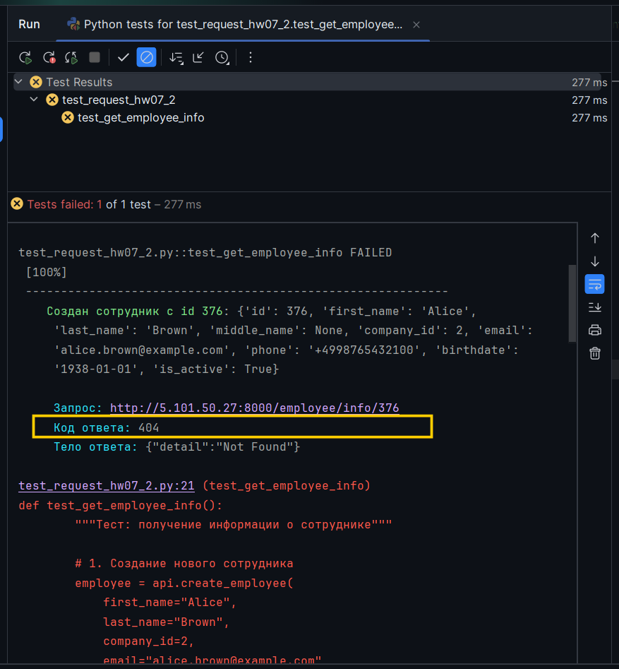  

<a id="img2" style="margin: 0 0 0 40px; color:#606060;">Fig. 2. ПАДЕНИЕ Теста 2 с ...info?id={employee_id}") эндпоинтом в employee_api.py.</a>


### <a id="ss2.2" style="color: #008000">**2.2.** РЕШЕНИЕ проблемы в Тесте 2</a>

1. В файле <a>employee_api.py</a> в функции `get_employee()` нужно было задать эндпоинт согласно документации 
[<font color="#696969">[5]</font>](#doc1):
`info/{employee_id}` вместо `/info?id={employee_id}`, как было в примере решения.

2. Непременно внести изменения в те данные, которые обязательны для изменения (см. [<font color="#696969">Fig. 4.3</font>](#img4)).


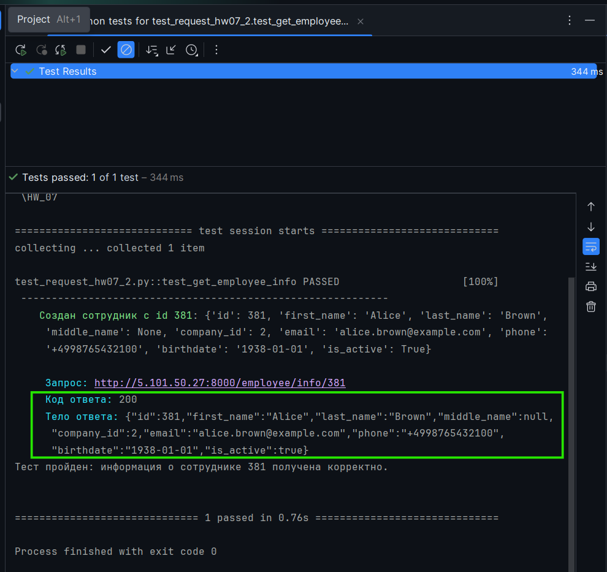  

<a id="img3" style="margin: 0 0 0 40px; color:#606060;">Fig. 3. НОРМАЛЬНО отработавший Тест 2 с эндпоинтом .../info/{employee_id}.</a>

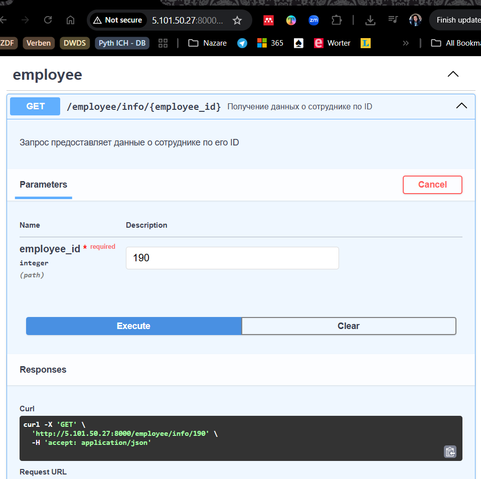  

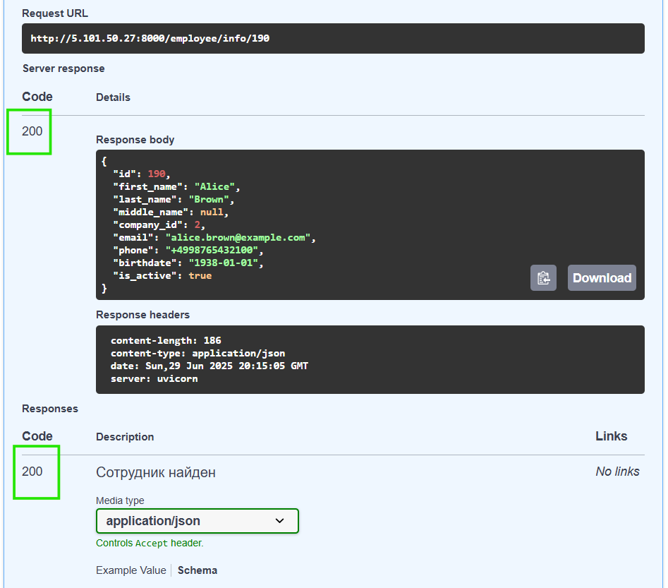  

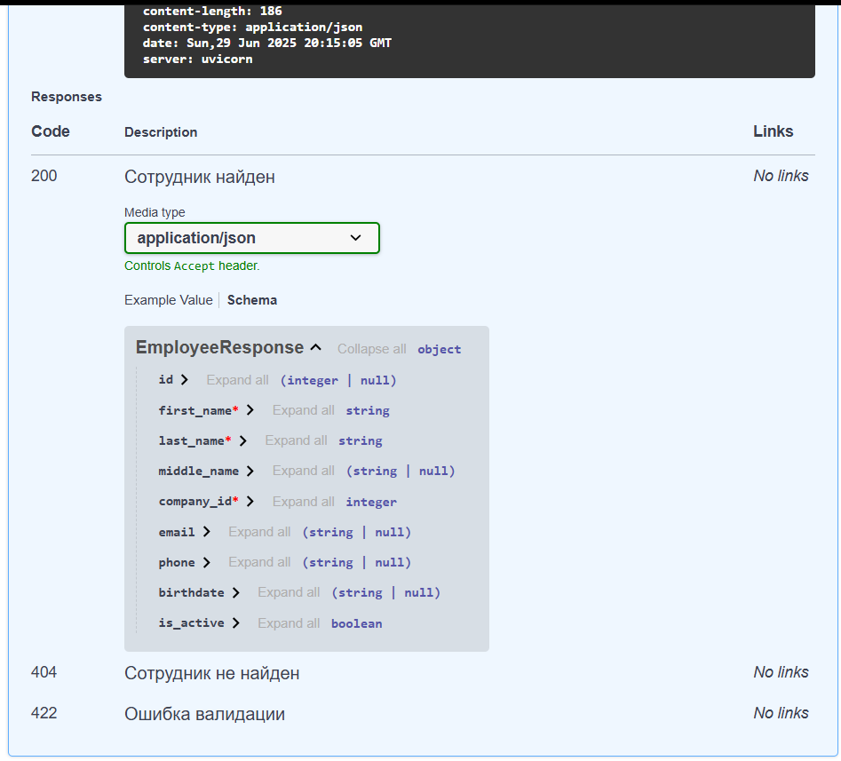  

<a id="img4" style="margin: 0 0 0 40px; color:#606060;">Fig. 4. Как должен был отработать Тест 2 по документации 5.101.50.27:8000/docs#.</a>


<div style="font: bold normal 110% sans-serif; color: #8A2BE2; white-space: pre; border-top: 2px dotted #008000; padding: 5px; margin: 40px 0 40px 0"></div>


## <a id="s3" style="color: #008000">3. Проблемы в Тесте 3 и их Решения</a>  

### <a id="ss3.1" style="color: #008000">**3.1.** ПРОБЛЕМА в Тесте 3: обновление данных сотрудника</a>
404 Not Found — ресурс не найден (см. [<font color="#696969">Fig. 4.3</font>](#img4)).

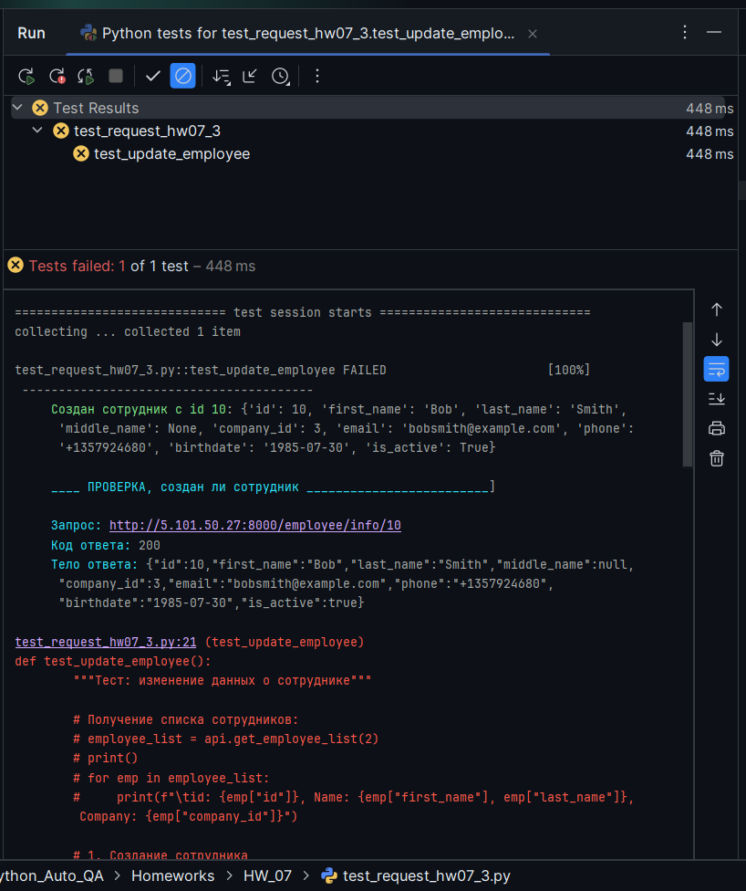  

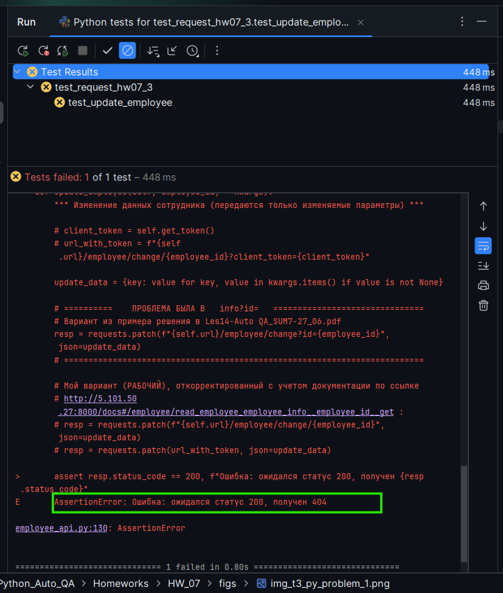    

<a id="img5" style="margin: 0 0 0 40px; color:#606060;">Fig. 5. ПАДЕНИЕ Теста 3 без токена и 
с ...info?id={employee_id} эндпоинтом в employee_api.py.</a>


### <a id="ss3.2" style="color: #008000">**3.2.** РЕШЕНИЕ проблемы в Тесте 3</a>

1. Добавить функцию `get_token()` получения токена, как указано в документации [<font color="#696969">[5]</font>](#doc1).
2. В файле <a>employee_api.py</a> в функции `update_employee()` нужно было задать обращение к токену и 
изменить эндпоинт согласно документации [<font color="#696969">[5]</font>](#doc1):
`change/{employee_id}?client_token={client_token}` вместо `/change?id={employee_id}`, как было в примере решения.
3. Непременно внести изменения в данные(см. [<font color="#696969">Fig. 6.1</font>](#img6)).

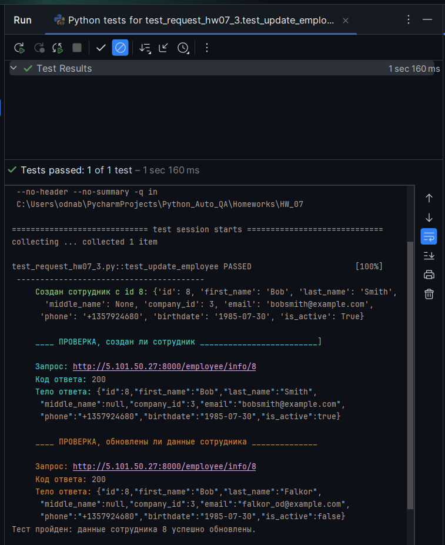  

<a id="img5" style="margin: 0 0 0 40px; color:#606060;">Fig. 5. НОРМАЛЬНО отработавший Тест 3 с токеном и измененным эндпоинтом.</a>

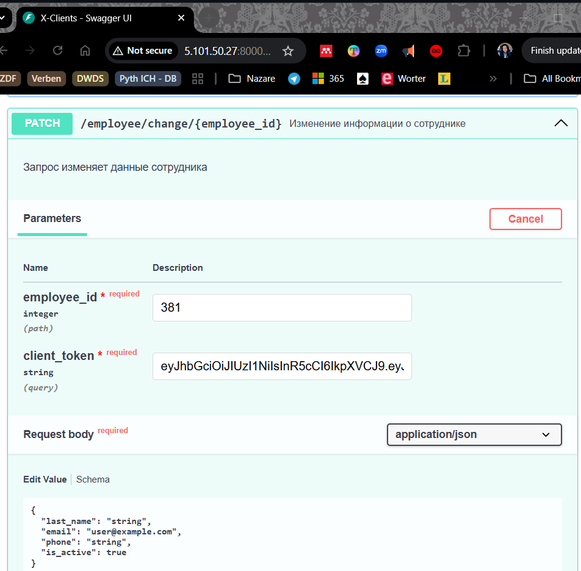  

  

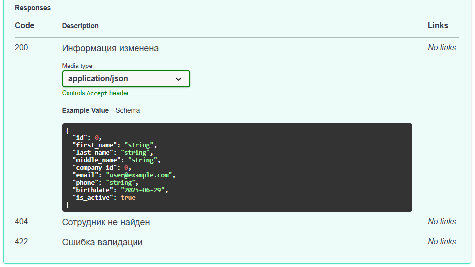  

<a id="img6" style="margin: 0 0 0 40px; color:#606060;">Fig. 6. Как должен был отработать Тест 3 по документации 5.101.50.27:8000/docs#.</a>


<div style="font: bold normal 110% sans-serif; color: #8A2BE2; white-space: pre; border-top: 2px dotted #008000; padding: 5px;"></div>  

## <a id="s4" style="color: #008000">4. GitHub</a>
Ссылка на комментарии по ДЗ <a>comments_hw_07.md</a> со скриншотами: https://github.com/odnabu/Auto-QA-Python/blob/main/Homeworks/HW_07/comments_hw_07.md.  

Ссылка на папку с ДЗ <a>HW_07</a>: https://github.com/odnabu/Auto-QA-Python/tree/main/Homeworks/HW_07.  

---
<div style="font: bold normal 110% sans-serif; color: #8A2BE2; white-space: pre; border-top: 2px dotted #8A2BE2; padding: 5px; margin: 40px 0 40px 0"></div>

[//]: # (Строка с отступами сверху и снизу --- <div style="margin: 40px 0 40px 0">Текст</div>)

[//]: # (Подзаголовок Фиол--- <div style="font: small-caps 120% sans-serif; color: #8A2BE2; padding: 0 15px 0 0;">▣ &nbsp;&nbsp; Выполните запросы:</div>  )

[//]: # (ссылка на источник --- [<font color="#696969">[1 ▶ V-13, \__:__]</font>]\(#__\).  )

[//]: # (<span style="color: #8A2BE2; margin: 20px 40px; padding: 5px; background: #000000;">▣ ⚜️ ☑️ ✔️ 🟪 ■ ※ ⁂ ⁙ ⁘ ⨠  ■ ◲◳ ◆ ◇ ◈ ◀ ▶ ◁ ▷ ▹ ▼ ▲ ▽ △ ▢ ₪₪₪</span>  ) 

[//]: # (🔷🔹 🟩 ❇️♾️⚜️✳️❎✅☑️✔️🟪🔳🔲  )
[//]: # (■ ⁜ ※ ⁂ ⁙ ⁘ ⫷ ⫸ ⩕ ⨠ ⨝ ⋘ ⋙ ∵ ∴ ∶ ∷ ■ ◪ ◩ ◲ ◳ ◆ ◇ ◈ ▼ ▽ ◀ ▶ ◁ ▷ ▹ ▲ △ ▢ ₪₪₪  )


[//]: # (NB! --- <div style="color: #F00000; margin: 40px 20px 20px 0;">)

[//]: # (<span style="border: 2px solid #6B0000; padding: 10px;"> NB ! </span>)

[//]: # (</div>)


[//]: # (Пробел  ---  &nbsp;&nbsp; spaces)

[//]: # (Линия-разделитель с отступами --- <div style="font: bold normal 110% sans-serif; color: #8A2BE2; white-space: pre; border-top: 2px dotted #008000; padding: 5px;"></div>)
