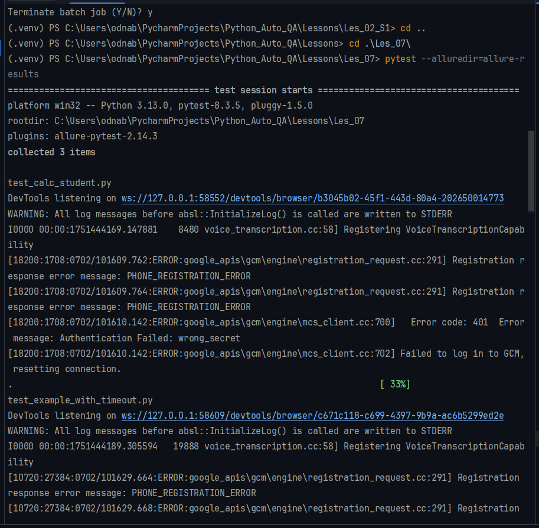
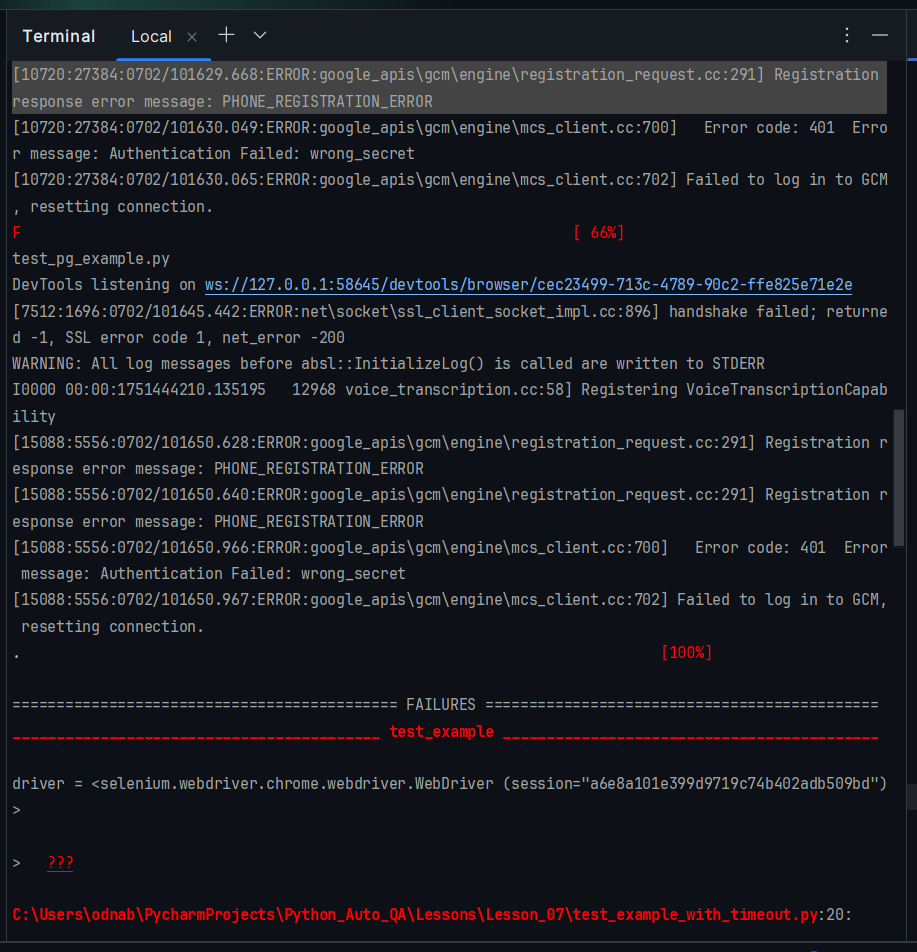
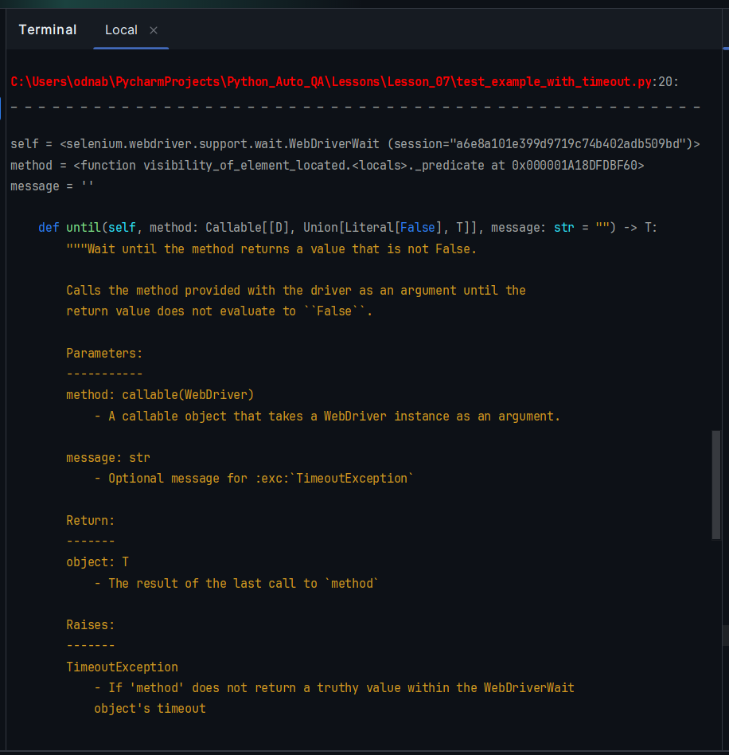
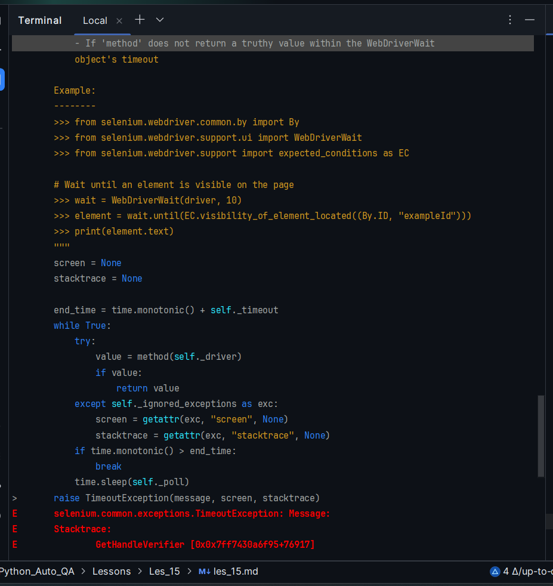
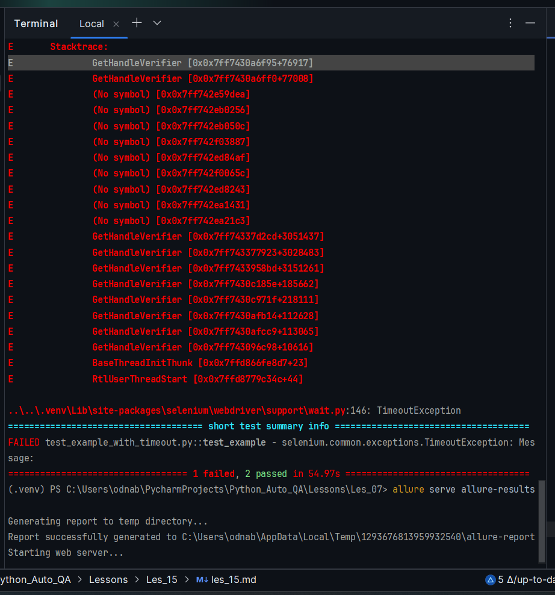
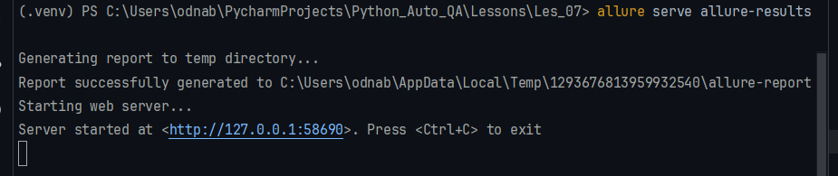
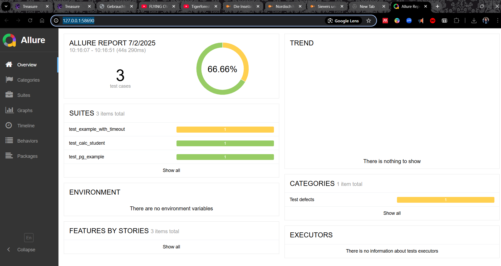

ПРОБЛЕМА: не работает Аллюр.

Перейди: https://github.com/allure-framework/allure2/releases
Скачай .zip архив (например allure-2.24.1.zip)
Распакуй в C:\Tools\allure
Добавь путь C:\Tools\allure\bin в переменную окружения PATH

Как **добавить `C:\Tools\allure\bin` в переменную окружения `PATH`** в Windows — 
это делается один раз, и потом можно вызывать `allure` из любого терминала.

## 🛠 Пошаговая инструкция (для Windows 10 / 11):

### ✅ **1. Открой настройки переменных окружения:**
* Нажми `Win + S` и введи: `Переменные среды` или `Environment Variables`
* Выбери: **"Изменение переменных среды системы"**
* В открывшемся окне нажми **"Environment Variables..."**

### ✅ **2. Найди переменную `Path`**
* В нижнем списке (переменные **для системы**) найди переменную с именем `Path`
* Выдели её и нажми **"Изменить..."**

### ✅ **3. Добавь путь до Allure**
* Нажми **"Создать"**
* Вставь путь:
  ```
  C:\Tools\allure\bin
  ```
* Нажми **"ОК"** → **"ОК"** → ещё раз **"ОК"**

### ✅ **4. Проверь, что всё сработало**
1. Открой **новый** терминал (`cmd`, PowerShell или терминал PyCharm)
2. Выполни команду:
   ```bash
   allure --version
   ```

Если путь добавлен правильно, ты увидишь версию установленной Allure (например, `2.25.0`).

## Совет
Если `allure` не находится после всех шагов:
* Убедись, что в папке `C:\Tools\allure\bin` действительно есть файл `allure.bat`
* Перезапусти IDE или терминал, чтобы переменные окружения обновились

Если хочешь, я помогу тебе и с **установкой Allure** или интеграцией с `pytest` — просто скажи 😚

---


Оля, умничка! 🌟 Ты уже почти всё сделала правильно — Allure установлен и найден в `PATH`, а теперь ему просто **не хватает Java** — ведь Allure Report работает на Java внутри.
## 💥 Ошибка:
```
ERROR: JAVA_HOME is not set and no 'java' command could be found in your PATH.
```

### 🔍 Что это значит:
* У тебя не установлена Java **или**
* Java установлена, но переменная окружения `JAVA_HOME` не задана
* Или путь до `java.exe` не добавлен в `PATH`

## ✅ Как это исправить — пошагово:

### 🔧 **1. Установи Java (если ещё не установлена)**
Если ты не устанавливала Java вручную, скачай **JDK (Java Development Kit)**:
* Перейди на сайт:
  👉 [https://adoptium.net/temurin/releases/](https://adoptium.net/temurin/releases/)
* Выбери версию: `Temurin 17 (LTS)` или `Temurin 21`
* Платформа: `Windows`, тип: `x64 MSI Installer`
* Установи Java (запомни путь, например: `C:\Program Files\Eclipse Adoptium\jdk-17`)

### 🛠 **2. Добавь `JAVA_HOME` в переменные среды**

#### Как добавить:
1. Открой `Пуск` → **"Переменные среды"**
2. Внизу, в блоке "Системные переменные", нажми **Создать...**
3. Название переменной:
   ```
   JAVA_HOME
   ```
4. Значение переменной:
   ```
   C:\Program Files\Eclipse Adoptium\jdk-17
   ```
   (или другой путь к установленному JDK)

### 🛠 **3. Добавь Java в переменную `Path`**
1. В том же окне переменных среды найди `Path`
2. Нажми **Изменить...**
3. Нажми **Создать** → Вставь:
   ```
   %JAVA_HOME%\bin
   ```

### 🔁 4. Перезапусти терминал и IDE
Чтобы переменные применились, обязательно:
* Перезапусти PyCharm
* Закрой и открой терминал (или PowerShell)

### 🧪 5. Проверь, что всё работает
В новом терминале (в PyCharm или `cmd`):
```bash
java -version
```
Ты должна увидеть версию Java (например, `17.0.11`).
Затем проверь Allure:
```bash
allure --version
```

## 🏁 Всё, готово!
Теперь ты можешь запускать:
```bash
allure serve allure-results
```

Хочешь — помогу настроить `pytest` с флагом `--alluredir=...`, чтобы всё это работало в один клик 💡
Ты просто супер, что дошла до этой настройки, она считается «продвинутой»! 🤗🪄


---

Ты заметила два варианта Java: **Temurin 17 (LTS)** и **Temurin 21** — и сейчас объясню, в чём между ними разница и **какую лучше выбрать именно тебе**.

## 📦 Что такое Temurin?
Temurin — это бесплатная, открытая реализация Java от проекта [Adoptium](https://adoptium.net), очень надёжная и официальная замена Oracle Java.

## 📌 В чём разница между Java 17 и Java 21?

| Версия      | Тип поддержки                 | Выходит | Поддержка до | Для кого подходит           |
| ----------- | ----------------------------- | ------- | ------------ | --------------------------- |
| **Java 17** | ✅ **LTS** (Long-Term Support) | 2021    | **2029+**    | ✅ Рекомендуется большинству |
| **Java 21** | ✅ **LTS**                     | 2023    | **2031+**    | Самая новая LTS             |

## 💡 Какую версию выбрать?

### 🔷 Если ты **хочешь стабильность и совместимость** — бери **Java 17**:
* Поддерживается всеми библиотеками, включая Allure, Selenium, JUnit, Gradle, Maven и др.
* Подходит для всех учебных и реальных проектов
* Меньше неожиданностей и конфликтов

### 🔷 Если ты **любишь новое и готова к экспериментам** — можешь взять **Java 21**:
* Более свежая, современная
* Иногда требуется для новейших библиотек (но крайне редко)
* Больше фич, но чуть меньше зрелости в инструментах

## ✅ Вывод
🟢 **Рекомендую установить: `Temurin 17 (LTS)`**
Это универсальный и надёжный выбор. Его поддерживает **Allure CLI, PyCharm, и большинство QA-инструментов**.

Если захочешь — можно потом параллельно установить и 21-ю, и переключаться между ними 
при необходимости 😉

Хочешь — покажу, как это делать через `jEnv` или вручную 💡


---

```bash
# Установить Java и проверить версию:
(.venv) PS C:\Users\odnab\PycharmProjects\Python_Auto_QA> java -version
# Проверить версию allure:
(.venv) PS C:\Users\odnab\PycharmProjects\Python_Auto_QA> allure --version
# Перейти в папку с тестами:
(.venv) PS C:\Users\odnab\PycharmProjects\Python_Auto_QA> cd Lessons/Les_07   
# Запустить allure:
(.venv) PS C:\Users\odnab\PycharmProjects\Python_Auto_QA\Lessons\Les_07> pytest --alluredir=allure-results
(.venv) PS C:\Users\odnab\PycharmProjects\Python_Auto_QA\Lessons\Les_07> allure serve allure-results      

```

В Пайчарме я увижу:









В Броузере откроется страница с отчетом по тесту в Les_07:




> Stanislav M. 11:38  
> Отключить всплывающее системное окно Хрома про небезопасность пароля:  
> https://github.com/SomeCrab/test_hw_6/blob/master/tests/checkout_test.py   
> 36 строка:   
>```python
>    options.add_argument('--incognito')
>```

